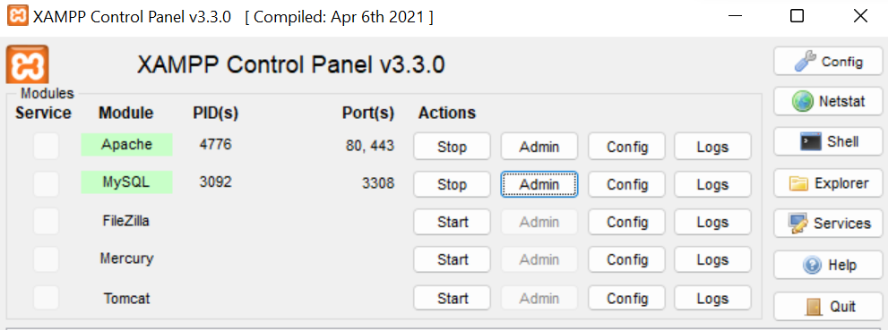

# Praktikum 10: PHP OOP

<strong>Repository ini dibuat untuk memenuhi tugas Pemrograman Web</strong>
| <strong>Nama</strong>      | <strong>Riris Naomi Gurning</strong>  |
| ----------- | ----------- |
| <strong>NIM</strong>     | <strong>312010190</strong>       |
| <strong>Kelas</strong>   | <strong>TI.20.A.1</strong>        |

```php
Pemrograman   berorientasi   objek   atau  object-oriented programming  (OOP)merupakan suatu pendekatan pemrograman yang menggunakan object dan class.
Tujuan dari OOP diciptakan adalah untuk mempermudah
pengembangan program dengan cara mengikuti model yang telah ada di kehidupan sehari-hari.
```
# Langkah-langkah Praktikum 10 "PHP OOP"
## Sebelum memulai langkah - langkah sebaiknya kita mengaktifkan atau menyalakan MySQL di Aplikasi Xampp


# 1. <strong>Membuat file baru dengan nama mobil.php</strong>
Masukkan kode dibawah ini:
```php
<?php
/**
* Program sederhana pendefinisian class dan pemanggilan class.
**/

class Mobil
{
    private $warna;
    private $merk;
    private $harga;

    public function __construct()
    {
        $this->warna = "Biru";
        $this->merk = "BMW";
        $this->harga = "10000000";
    }
    public function gantiWarna ($warnaBaru)
    {
        $this->warna = $warnaBaru;
    }
    public function tampilWarna ()
    {
        echo "Warna mobilnya : " . $this->warna;
    }
}

// membuat objek mobil
$a = new Mobil();
$b = new Mobil();

// memanggil objek
echo "<b>Mobil pertama</b><br>";
$a->tampilWarna();
echo "<br>Mobil pertama ganti warna<br>";
$a->gantiWarna("Merah");
$a->tampilWarna();

// memanggil objek
echo "<br><b>Mobil kedua</b><br>";
$b->gantiWarna("Hijau");
$b->tampilWarna();
?>
```
# 2. Membuat file baru dengan nama form.php
Masukkan kode dibawah ini:

```php
<?php
/**
* Nama Class: Form
* Deskripsi: CLass untuk membuat form inputan text sederhan
**/

class Form
{
    private $fields = array();
    private $action;
    private $submit = "Submit Form";
    private $jumField = 0;
    public function __construct($action, $submit)
    {
        $this->action = $action;
        $this->submit = $submit;
    }
    public function displayForm()
    {
        echo "<form action='".$this->action."' method='POST'>";
        echo '<table width="100%" border="0">';
        for ($j=0; $j<count($this->fields); $j++) {
        echo "<tr><td
align='right'>".$this->fields[$j]['label']."</td>";
            echo "<td><input type='text'
name='".$this->fields[$j]['name']."'></td></tr>";
    }
        echo "<tr><td colspan='2'>";
        echo "<input type='submit' value='".$this->submit."'></td></tr>";
        echo "</table>";
    }
    public function addField($name, $label)
    {
        $this->fields [$this->jumField]['name'] = $name;
        $this->fields [$this->jumField]['label'] = $label;
        $this->jumField ++;
    }
}
?>
```
